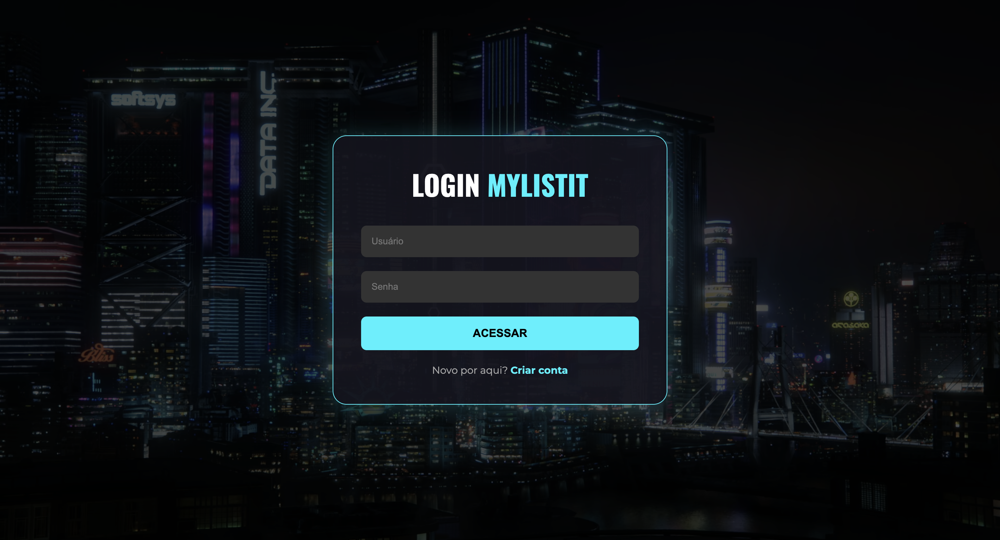
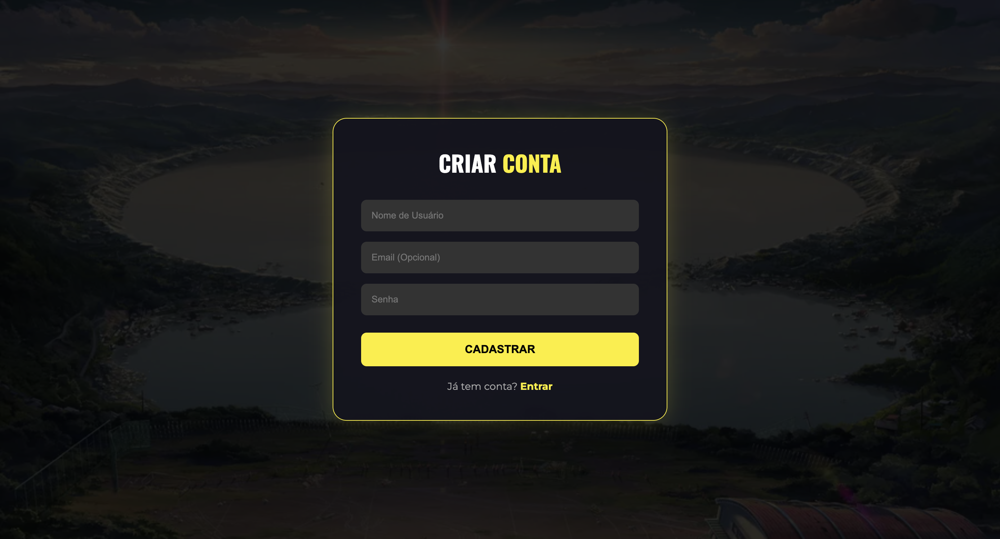
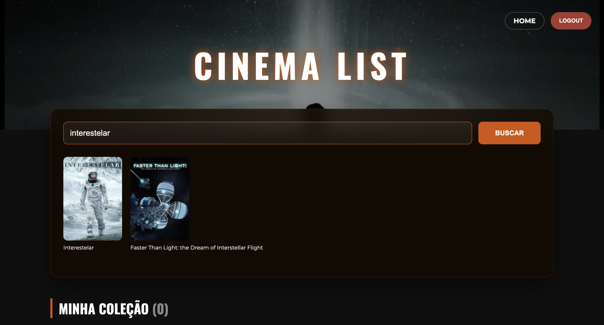

 

  

 

### <strong>Gerencie, avalie e organize todo o seu universo de entretenimento.</strong>

  

<!-- BADGES -->      

---

# ⚡ Sobre o Projeto

### MyListIt é uma aplicação Full Stack imersiva desenvolvida para entusiastas de cinema e cultura pop japonesa.

#### - UI/UX premium e animada

#### - Integração com APIs globais

#### - Autenticação segura

#### - Dashboard interativo e moderno

### Com ele, você pode criar sua coleção pessoal de filmes e animes, acompanhar o que já viu e salvar o que pretende assistir.

---
# 🎬 Vídeo do Projeto
...
---

# 📸 Galeria

  <h3>Home</h3>
  <table>
    <tr>
      <td align="center">
        
         <em>Home 1</em>
      </td>
    </tr>
  </table>
  <table>
    <tr>
      <td align="center">
        
         <em>Home 2</em>
      </td>
      <td align="center">
        
         <em>Home 3</em>
      </td>
    </tr>
  </table>
  
  <h3>Authentication</h3>
  <table>
    <tr>
      <td align="center">
        
         <em>Login Page</em>
      </td>
      <td align="center">
        
         <em>Register Page</em>
      </td>
    </tr>
  </table>

  <h3>Pages</h3>
  <table>
    <tr>
      <td align="center">
        
         <em>Anime Page</em>
      </td>
      <td align="center">
        
         <em>Movie Page</em>
      </td>
    </tr>
  </table>

---

# 🚀 Funcionalidades
### 🔐 Autenticação Completa (JWT)

- Registro, Login e Logout

- Dados isolados por usuário

- Tokens seguros via Simple JWT

### 🌐 Integração Multi-API

- 🇯🇵 Jikan API → dados oficiais do MyAnimeList

- 🎬 TMDB API → filmes do mundo todo

### 🎨 Frontend Imersivo

- Scroll Snap → navegação estilo apresentação

- Framer Motion → animações fluidas

- Parallax Tilt → cards 3D responsivos

- Glassmorphism → UI moderna com profundidade

### 🧱 Backend Robusto

- API RESTful com Django + DRF

- SQLite para o banco

- Endpoints seguros e performáticos

---

# 🛠️ Tech Stack

### Frontend:

- React (Vite)

- Axios (interceptors & auth)

- Framer Motion

- React Parallax Tilt

- React Router DOM

### Backend:

- Python 3

- Django

- Django Rest Framework

- JWT

- SQLite

---

# 🔮 Futuro

 - Deploy do Backend

 - Deploy do Frontend

 - Perfil público de usuário (modo social)

 - Tema Claro/Escuro

---

 
Desenvolvido com muito café por <strong>Gabriel Beloni ☕</strong>.
 

